# Laporan Proyek Machine Learning - Sistem Rekomendasi Buku

**Nama:** Moch Nazham Ismul Azham
**Dataset:** Book Crossing Dataset

---

## Project Overview (Ulasan Proyek)

### Latar Belakang

Di era digital ini, akses terhadap informasi dan hiburan, termasuk buku, menjadi semakin mudah. Berbagai platform penjualan buku online, perpustakaan digital, dan aplikasi ulasan buku seperti Goodreads menawarkan jutaan judul kepada pembaca. Meskipun kekayaan pilihan ini menguntungkan, tidak jarang pengguna mengalami *information overload*, sebuah kondisi di mana mereka kesulitan menemukan buku yang benar-benar sesuai dengan minat dan preferensi pribadi mereka. Fenomena ini, sering disebut sebagai "paradox of choice" [^1], dapat mengurangi kepuasan pengguna dan efektivitas platform dalam menyajikan konten yang relevan.

Sistem rekomendasi buku hadir sebagai solusi untuk mengatasi tantangan ini. Dengan menganalisis riwayat baca, preferensi genre yang dinyatakan, rating yang diberikan, dan karakteristik buku lainnya, sistem ini dapat menyarankan judul-judul yang paling mungkin menarik bagi setiap pengguna secara individual. Industri penerbitan dan penjualan buku global terus menunjukkan vitalitas, dengan nilai pasar yang signifikan. Platform seperti Amazon telah lama memanfaatkan sistem rekomendasi untuk meningkatkan pengalaman pengguna dan penjualan buku [^2]. Personalisasi dalam penemuan buku dapat secara signifikan meningkatkan *engagement* pembaca.

### Domain Proyek

Sistem rekomendasi adalah salah satu aplikasi *machine learning* yang paling berdampak dan luas penggunaannya dalam berbagai industri, termasuk industri perbukuan dan konten digital. Dengan memanfaatkan data historis interaksi pengguna dengan item (buku) dan karakteristik item itu sendiri, sistem ini mampu memberikan prediksi akurat mengenai preferensi pengguna terhadap buku-buku yang belum pernah mereka baca sebelumnya.

**Referensi:**
1.  Schwartz, B. (2004). *The Paradox of Choice: Why More Is Less*. Harper Perennial.
2.  Smith, B., & Linden, G. (2017). Two Decades of Recommender Systems at Amazon.com. *IEEE Internet Computing*, 21(3), 12-18. 

### Mengapa Proyek Ini Penting

Proyek pengembangan sistem rekomendasi buku ini penting karena beberapa alasan mendasar:

1.  **Meningkatkan Pengalaman Pengguna:** Membantu pembaca menemukan buku yang mereka sukai dengan lebih mudah dan cepat, mengurangi frustrasi akibat terlalu banyak pilihan dan meningkatkan kesenangan membaca.
2.  **Meningkatkan *Engagement* dan Retensi Pengguna:** Rekomendasi yang relevan dapat mendorong pengguna untuk lebih aktif berinteraksi dengan platform (membaca lebih banyak, memberikan ulasan) dan meningkatkan loyalitas mereka.
3.  **Nilai Bisnis bagi Platform/Penerbit:** Sistem rekomendasi yang efektif dapat berkontribusi pada peningkatan penjualan buku, penemuan penulis baru, dan pemahaman yang lebih baik tentang tren pembaca.
4.  **Personalisasi dalam Skala Besar:** Menyediakan pengalaman penemuan buku yang disesuaikan untuk setiap pengguna di antara jutaan pembaca dan judul buku yang tersedia.

---

## Business Understanding

### Problem Statements (Pernyataan Masalah)

Berdasarkan analisis konteks pengguna dan platform buku, beberapa pernyataan masalah utama yang ingin diatasi adalah:

1.  **Kesulitan Menemukan Buku yang Sesuai:** Pembaca seringkali kesulitan memilih buku dari katalog yang sangat besar, menyebabkan kelelahan dalam mengambil keputusan (*decision fatigue*) dan potensi kehilangan minat.
2.  **Penemuan Konten Buku Baru dan Beragam:** Pembaca mungkin tidak menyadari keberadaan buku-buku yang sesuai dengan selera mereka, terutama jika buku tersebut berasal dari penulis yang kurang dikenal, genre niche, atau baru dirilis.
3.  ***Cold Start Problem* untuk Buku dan Pengguna Baru:** Bagaimana memberikan rekomendasi yang akurat kepada pengguna baru yang belum memiliki riwayat baca atau untuk buku baru yang belum mendapatkan banyak ulasan atau interaksi?
4.  **Kebutuhan akan Rekomendasi yang Dipersonalisasi:** Rekomendasi generik ("buku terlaris") seringkali kurang efektif; pengguna mengharapkan saran yang disesuaikan dengan preferensi unik dan riwayat baca mereka.

### Goals (Tujuan)

Tujuan dari proyek sistem rekomendasi buku ini adalah:

1.  **Mengembangkan Sistem Rekomendasi Buku yang Akurat:** Membangun model yang dapat memprediksi preferensi pengguna terhadap buku dengan tingkat akurasi yang baik.
2.  **Memberikan Rekomendasi Buku yang Relevan dan Bervariasi:** Menghasilkan daftar rekomendasi Top-N yang sesuai dengan selera pengguna, sekaligus memperkenalkan buku-buku baru atau dari genre berbeda yang mungkin diminati.
3.  **Mengatasi *Cold Start Problem* (Sebagian):** Mengimplementasikan pendekatan yang dapat memberikan rekomendasi bahkan dengan data historis yang minim untuk buku atau pengguna baru.
4.  **Menyajikan Dua Pendekatan Rekomendasi:** Mengimplementasikan dan membandingkan metode *Content-Based Filtering* dan *Collaborative Filtering* untuk rekomendasi buku.

### Solution Approach

Untuk mencapai tujuan yang telah ditetapkan, proyek ini akan mengimplementasikan dua pendekatan utama dalam sistem rekomendasi buku:

1.  **Content-Based Filtering:**
    * **Prinsip:** Merekomendasikan buku berdasarkan kesamaan atribut atau konten (seperti judul, penulis, penerbit) dengan buku yang pernah disukai pengguna atau buku yang sedang dilihat.
    * **Implementasi Teknis:** Menggunakan TF-IDF (Term Frequency-Inverse Document Frequency) untuk mengubah fitur tekstual buku menjadi representasi vektor, kemudian menghitung kemiripan antar buku menggunakan Cosine Similarity.
2.  **Collaborative Filtering:**
    * **Prinsip:** Merekomendasikan buku berdasarkan preferensi pengguna lain yang memiliki pola rating atau selera serupa ("pengguna yang menyukai buku A juga menyukai buku B").
    * **Implementasi Teknis:** Menggunakan algoritma SVD (Singular Value Decomposition), sebuah teknik faktorisasi matriks, yang diimplementasikan menggunakan library `Surprise`.

---

## Data Understanding

### Informasi Awal Dataset:

Dataset yang digunakan adalah **Book-Crossing Dataset**. Dataset ini terdiri dari tiga file CSV:
* `BX-Book-Ratings.csv`: Berisi informasi rating buku oleh pengguna.
* `BX-Books.csv`: Berisi informasi detail buku.
* `BX-Users.csv`: Berisi informasi pengguna.

**Tautan sumber data** [https://www.kaggle.com/datasets/syedjaferk/book-crossing-dataset](https://www.kaggle.com/datasets/syedjaferk/book-crossing-dataset):

**Karakteristik Dataset**

Dataset dimuat dengan `encoding='latin1'`, delimiter `';'`, dan `on_bad_lines='skip'` untuk menangani baris yang bermasalah.

**1. Rating Dataset (`ratings`)**
* Jumlah Data: 1.149.780 entri.
* Kolom:
    * `User-ID` (int64): ID unik pengguna.
    * `ISBN` (object/string): ID unik buku.
    * `Book-Rating` (int64): Rating yang diberikan pengguna (0-10).
* Kondisi: Tidak ada nilai yang hilang, tipe data sesuai.

**2. Book Dataset (`books`)**
* Jumlah Data: 271.360 entri.
* Kolom:
    * `ISBN` (object/string): ID unik buku.
    * `Book-Title` (object/string): Judul buku.
    * `Book-Author` (object/string): Penulis buku (terdapat 2 missing values).
    * `Year-Of-Publication` (object/string): Tahun publikasi (perlu pembersihan dan konversi ke numerik).
    * `Publisher` (object/string): Penerbit buku (terdapat 2 missing values).
    * `Image-URL-S`, `Image-URL-M`, `Image-URL-L` (object/string): URL gambar sampul buku (lengkap, namun 3 missing value di `Image-URL-L`).
* Kondisi: Terdapat sedikit missing values pada `Book-Author` dan `Publisher`. `Year-Of-Publication` memerlukan perhatian khusus karena bertipe `object` dan kemungkinan mengandung nilai non-numerik. dan Kolom URL gambar akan dihapus karena tidak krusial untuk model.

**3. User Dataset (`users`)**
* Jumlah Data: 278.858 entri.
* Kolom:
    * `User-ID` (int64): ID unik pengguna.
    * `Location` (object/string): Lokasi pengguna.
    * `Age` (float64): Usia pengguna (banyak data hilang, sekitar 39.7%).
* Kondisi: Kolom `Age` memiliki banyak nilai hilang dan tipe datanya `float64` yang sebaiknya diubah ke `integer` setelah penanganan missing value dan outlier.

### Exploratory Data Analysis (EDA)
Visualisasi data sebelum melalui tahap preparation, untuk memahami distribusi dan karakteristik data

**1. Distribusi Usia Pengguna**: 
        - Mayoritas pengguna berusia antara 15 hingga 50 tahun.
        - Ada outlier di bawah 5 tahun dan di atas 100 tahun (termasuk 0 dan 244), yang tampaknya tidak valid.
    Selanjutnya: data usia yang tidak valid akan di bersihkan dengan cara:
        - Menjadikan NaN jika usia < 5 atau > 100
        - Lalu, data NaN diganti dengan median.
```python
# Set style for better visuals
sns.set(style="whitegrid")

# Plot distribusi umur sebelum pembersihan
plt.figure(figsize=(12, 6))
sns.histplot(users['Age'], bins=50, kde=True, color='skyblue')
plt.title("Distribusi Umur Pengguna (Sebelum Pembersihan)")
plt.xlabel("Umur")
plt.ylabel("Jumlah Pengguna")
plt.xlim(0, 100)  # Fokus pada rentang yang wajar
plt.tight_layout()
plt.show()
```
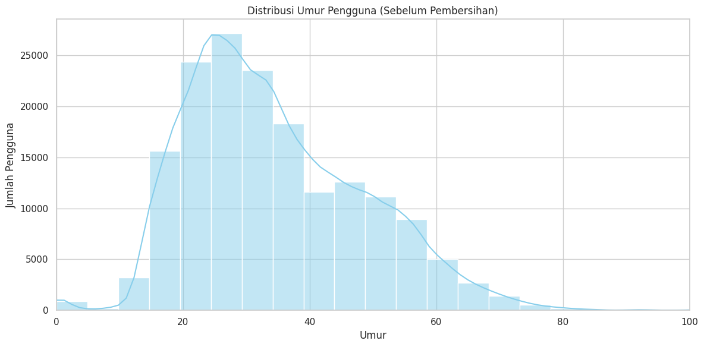

**2. Distribusi tahun Terbit buku**: 
        - Sebagian besar buku terbit antara 1950–2005.
        - Terdapat nilai tidak valid seperti:
            - Tahun 0
            - Tahun lebih dari 2025
        - Hal ini menunjukkan adanya noise yang perlu dibersihkan sebelum analisis atau sistem rekomendasi dilakukan.
```python
books['Year-Of-Publication'] = pd.to_numeric(books['Year-Of-Publication'], errors='coerce')

plt.figure(figsize=(12, 6))
sns.histplot(books['Year-Of-Publication'].dropna(), bins=50, color='orange')
plt.title("Distribusi Tahun Terbit Buku")
plt.xlabel("Tahun Terbit")
plt.ylabel("Jumlah Buku")
plt.xlim(1900, 2025)
plt.tight_layout()
plt.show()
```
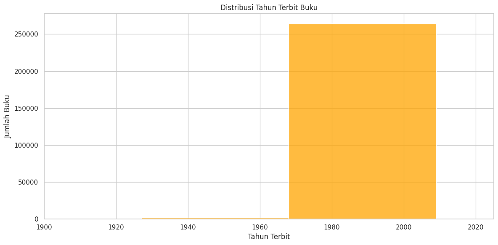

**3. Distribusi Buku terbanyak per penerbit**: 
* Beberapa penerbit besar seperti Harlequin, Penguin Books, atau Scholastic Inc. mendominasi jumlah buku.
```python
top_publishers = books['Publisher'].value_counts().head(10)

sns.barplot(x=top_publishers.values, y=top_publishers.index, palette='magma')
plt.title("Top 10 Publisher dengan Jumlah Buku Terbanyak")
plt.xlabel("Jumlah Buku")
plt.ylabel("Publisher")
plt.tight_layout()
plt.show()
```
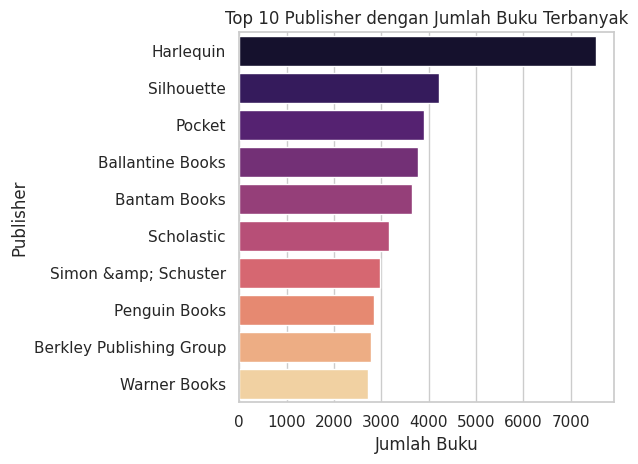

**4. Distribusi Ratings**: 
* Rating 0 sangat mendominasi → ini kemungkinan besar bukan rating nyata, tetapi interaksi tanpa evaluasi (implicit feedback).
* Rentang rating 1–10 cukup bervariasi dan menunjukkan penggunaan eksplisit sistem rating.
* Pengguna yang memberikan rating dominan memberikan rating 8
```python
sns.countplot(x='Book-Rating', data=ratings, palette='coolwarm')
plt.title("Distribusi Nilai Rating Buku")
plt.xlabel("Nilai Rating")
plt.ylabel("Jumlah")
plt.tight_layout()
plt.show()
```
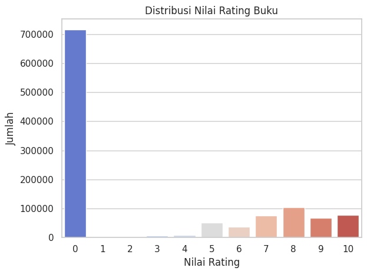

### Exploratory Data Analysis Lanjutan (EDA)
Visualisasi data dilakukan untuk memahami distribusi dan karakteristik data lebih lanjut setelah melakukan pembersihan data.

**1. Distribusi Tahun Publikasi Buku**: 
* Mayoritas buku dalam dataset diterbitkan setelah tahun 1950, dengan puncak signifikan dalam beberapa dekade terakhir sebelum tahun ini. Terdapat beberapa outlier tahun publikasi yang tidak valid (misalnya, tahun 0 atau masa depan) yang perlu ditangani.
    ```python
    plt.figure(figsize=(8, 4))
    sns.histplot(books['Year_Of_Publication'], bins=50, color='skyblue')
    plt.title('Distribusi Tahun Publikasi Buku')
    plt.xlabel('Tahun Publikasi')
    plt.ylabel('Jumlah Buku')
    plt.xlim(1800, pd.to_datetime('today').year + 5)
    plt.show()
    
    ```
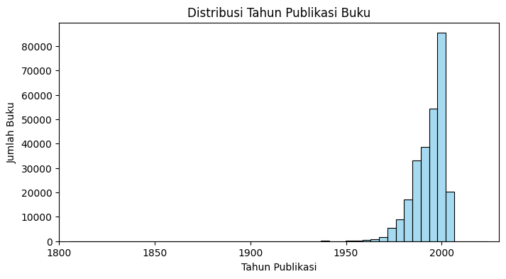

**2. Distribusi Usia Pengguna**: 
* Sebagian besar pengguna aktif berusia antara 20 hingga 40 tahun. Terdapat pengguna dengan usia yang tidak realistis (sangat muda atau sangat tua) dan banyak nilai usia yang hilang yang perlu ditangani.
    ```python
    plt.figure(figsize=(8, 4))
    sns.histplot(users['Age'], bins=30, kde=True, color='salmon')
    plt.title('Distribusi Usia Pengguna')
    plt.xlabel('Usia')
    plt.ylabel('Jumlah Pengguna')
    plt.show()
    ```
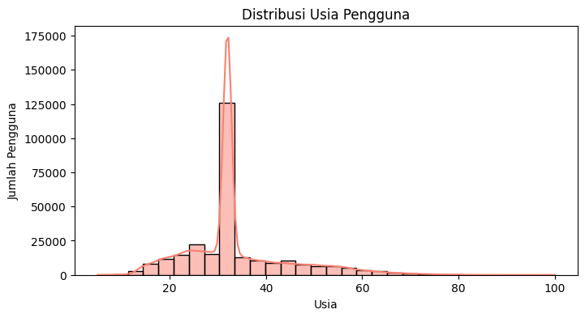

**3. Distribusi Rating Eksplisit**: 
* Rating buku (setelah memfilter rating implisit bernilai 0) menunjukkan bahwa pengguna cenderung memberikan rating tinggi (7-10), dengan rating 8 sebagai yang paling umum. Rating rendah (1-3) lebih jarang diberikan.
    ```python
    plt.figure(figsize=(8, 4))
    sns.countplot(x='Book_Rating', data=ratings_explicit, palette='viridis')
    plt.title('Distribusi Rating Buku (1–10)')
    plt.xlabel('Rating')
    plt.ylabel('Jumlah')
    plt.show()
    ```
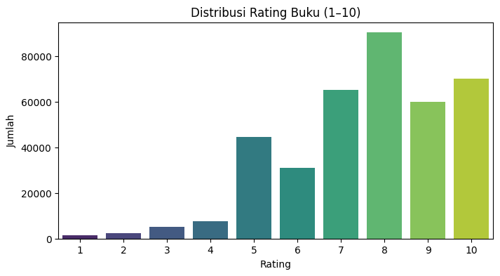

**4. Jumlah Rating Selama Proses Filtering**: 
* Visualisasi menunjukkan bagaimana jumlah rating berkurang secara signifikan pada setiap tahap filtering (sinkronisasi, penggunaan rating eksplisit, filter pengguna aktif, filter buku populer). Ini menggarisbawahi pentingnya filtering untuk kualitas data input model.
    ```python
    plt.figure(figsize=(8, 4))
    counts = [1017064, len(ratings_explicit), len(ratings_filtered), len(final_ratings)]
    labels = ['Sync', 'Eksplisit', 'Pengguna Aktif', 'Buku Populer']
    sns.barplot(x=labels, y=counts, palette='coolwarm')
    plt.title('Jumlah Rating di Tiap Tahap Filtering')
    plt.ylabel('Jumlah')
    plt.show()
    ```
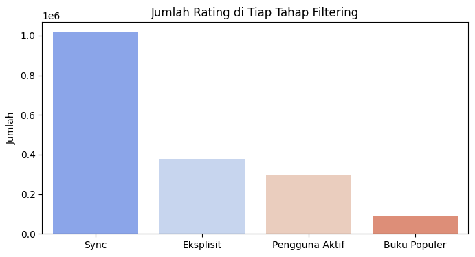

**5. Distribusi Rating per Pengguna (Final)**: 
* Setelah filtering, sebagian besar pengguna aktif memberikan sekitar 5-20 rating. Hanya sedikit pengguna yang memberikan rating dalam jumlah sangat besar.
    ```python
    plt.figure(figsize=(8, 4))
    sns.histplot(final_ratings['User_ID'].value_counts(), bins=50, color='lightgreen')
    plt.title('Jumlah Rating per Pengguna (Final)')
    plt.xlabel('Jumlah Rating')
    plt.ylabel('Jumlah Pengguna')
    plt.show()
    ```
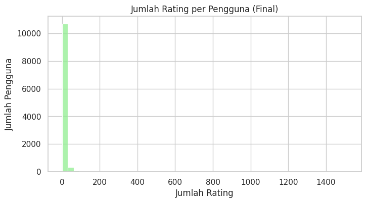

**6. Distribusi Rating per Buku (Final)**: 
* Mayoritas buku populer dalam dataset final memiliki antara 10 hingga 30 rating. Sangat sedikit buku yang memiliki jumlah rating yang sangat tinggi.
    ```python
    plt.figure(figsize=(8, 4))
    sns.histplot(final_ratings['ISBN'].value_counts(), bins=50, color='gold')
    plt.title('Jumlah Rating per Buku (Final)')
    plt.xlabel('Jumlah Rating')
    plt.ylabel('Jumlah Buku')
    plt.show()
    ```
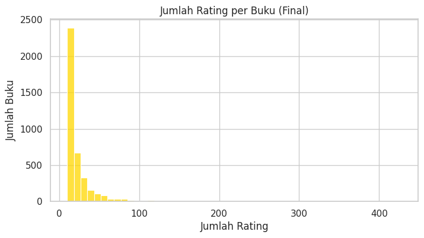

**7. Top Penulis**: 
* Analisis penulis teratas (baik untuk data Collaborative Filtering maupun Content-Based) menunjukkan beberapa nama yang dominan, yang menandakan popularitas atau produktivitas tinggi dari penulis tersebut dalam dataset.
    ```python
    plt.figure(figsize=(8, 4))
    top_authors_cf = books_final['Book_Author'].value_counts().nlargest(10)
    sns.barplot(y=top_authors_cf.index, x=top_authors_cf.values, palette='mako')
    plt.title('Top 10 Penulis (Collaborative Filtering)')
    plt.xlabel('Jumlah Buku')
    plt.ylabel('Penulis')
    plt.show()
    ```
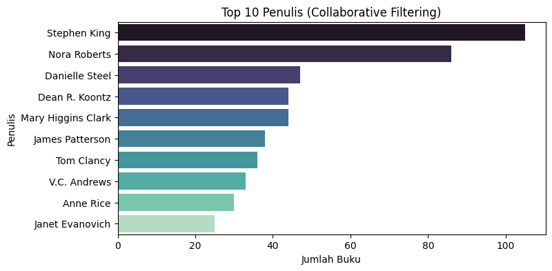
    ```python
    plt.figure(figsize=(8, 4))
    top_authors_cb = books_cb['Book_Author'].value_counts().nlargest(10)
    sns.barplot(y=top_authors_cb.index, x=top_authors_cb.values, palette='flare')
    plt.title('Top 10 Penulis (Content-Based)')
    plt.xlabel('Jumlah Buku')
    plt.ylabel('Penulis')
    plt.show()
    ```
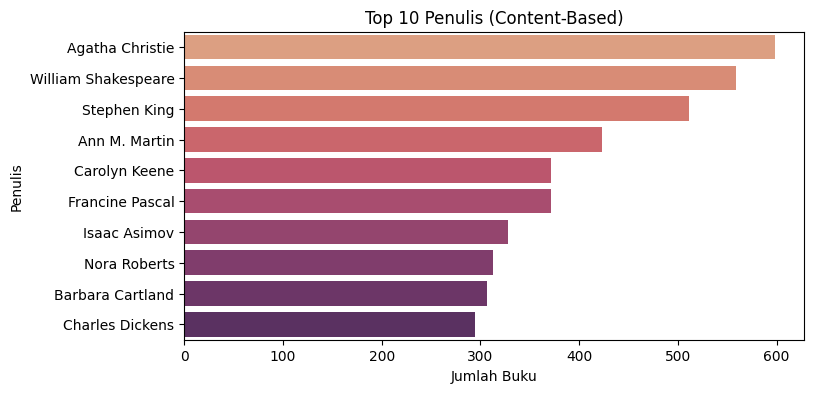
---


## Data Preparation

Tahap data preparation sangat krusial untuk memastikan kualitas dan kesesuaian data sebelum digunakan dalam pemodelan sistem rekomendasi. Proses ini melibatkan serangkaian teknik pembersihan, transformasi, dan filtering pada dataset Book-Crossing (`books`, `users`, dan `ratings`). Berikut adalah tahapan yang dilakukan secara berurutan:

### 1. Penyesuaian Nama Kolom

* **Teknik:** Mengganti nama kolom pada DataFrame `users`, `books`, dan `ratings` agar lebih konsisten dan mudah digunakan (`User-ID` menjadi `User_ID`, `Book-Title` menjadi `Book_Title`, menghilangkan tanda hubung atau spasi jika ada).
```python
# --- Penyesuaian Nama Kolom agar konsisten---
print("\n--- Menyesuaikan Nama Kolom ---")
users.columns = ['User_ID', 'Location', 'Age']
books.columns = ['ISBN', 'Book_Title', 'Book_Author', 'Year_Of_Publication', 'Publisher', 'Image_URL_S', 'Image_URL_M', 'Image_URL_L']
ratings.columns = ['User_ID', 'ISBN', 'Book_Rating']

print("Nama kolom Users:", users.columns.tolist())
print("Nama kolom Books:", books.columns.tolist())
print("Nama kolom Ratings:", ratings.columns.tolist())
```

* **Proses:** Nama-nama kolom asli dari file CSV disesuaikan dengan standar penamaan yang lebih seragam.
* **Alasan:** Konsistensi nama kolom sangat penting untuk meningkatkan keterbacaan kode dan mempermudah pengolahan data selanjutnya. Ini juga mengurangi kemungkinan error saat melakukan operasi seperti *join*, *merge*, atau transformasi data antar DataFrame.

### 2. Membersihkan Dataset `books`

Dataset `books` memerlukan beberapa langkah pembersihan untuk memastikan kualitas fitur yang akan digunakan. Jumlah data `books` sebelum persiapan adalah [271.360 data, dan 8 kolom].

1.  **Menghapus Kolom URL Gambar:**
    * **Teknik:** Kolom `Image_URL_S`, `Image_URL_M`, dan `Image_URL_L` dihapus dari DataFrame `books`.
        ```python
        books.drop(['Image_URL_S', 'Image_URL_M', 'Image_URL_L'], axis=1, inplace=True)
        print("Kolom URL gambar dihapus.")
        ```
    * **Proses:** Menggunakan fungsi `drop()` dari pandas untuk menghilangkan kolom-kolom tersebut.
    * **Alasan:** Kolom URL gambar tidak memberikan kontribusi langsung terhadap rekomendasi berbasis rating atau konten tekstual dalam konteks proyek ini, sehingga penghapusannya dapat menyederhanakan dataset.

2.  **Menangani Missing Value kolom (`Book_Author`, `Publisher`):**
    * **Teknik:** Baris yang memiliki nilai hilang (NaN) pada kolom `Book_Author` dan `Publisher` dihapus.
        ```python
        print(f"Missing values di Book_Author sebelum penghapusan: {books['Book_Author'].isnull().sum()}")
        print(f"Missing values di Publisher sebelum penghapusan: {books['Publisher'].isnull().sum()}")
        books.dropna(subset=['Book_Author', 'Publisher'], inplace=True)
        print(f"Missing values di Book_Author setelah penghapusan: {books['Book_Author'].isnull().sum()}")
        print(f"Missing values di Publisher setelah penghapusan: {books['Publisher'].isnull().sum()}")
        ```
    * **Proses:** Menggunakan `dropna()` dengan parameter `subset` untuk menargetkan kolom spesifik.
    * **Alasan:** Jumlah data yang hilang pada kolom-kolom ini relatif kecil. Penghapusan baris adalah pendekatan yang sederhana dan efektif untuk menjaga kualitas data fitur yang penting untuk content-based filtering.

3.  **Mengubah Tipe Data dan Membersihkan kolom `Year_Of_Publication`:**
    * **Teknik:** Kolom `Year_Of_Publication` dikonversi ke tipe numerik, nilai yang tidak valid diubah menjadi NaN, baris dengan NaN tersebut dihapus, dan setelah penghapusan tipe data diubah menjadi integer.
        ```python
        # Year-Of-Publication
        print(f"Tipe data Year_Of_Publication sebelum: {books['Year_Of_Publication'].dtype}")
        
        # Konversi ke numerik, paksa error menjadi NaN
        books['Year_Of_Publication'] = pd.to_numeric(books['Year_Of_Publication'], errors='coerce')

        # Hapus baris dengan NaN di Year_Of_Publication setelah konversi (jika ada yang tidak bisa dikonversi)
        books.dropna(subset=['Year_Of_Publication'], inplace=True)

        # Ubah ke integer
        books['Year_Of_Publication'] = books['Year_Of_Publication'].astype(int)
        
        print(f"Tipe data Year_Of_Publication setelah: {books['Year_Of_Publication'].dtype}")

        ```
    * **Proses:** Menggunakan `pd.to_numeric()` dengan `errors='coerce'` untuk mengubah nilai non-numerik menjadi NaN, diikuti `dropna()` untuk menghapus nilai nya dan `astype(int)` untuk mengubah tipe data ke integer.
    * **Alasan:** Kolom `Year_Of_Publication` awalnya bertipe `object` dan mungkin mengandung nilai teks atau format tahun yang salah. Konversi ke tipe integer diperlukan agar data tahun bisa diproses secara numerik untuk analisis atau sebagai fitur model.

4.  **Menangani Outliers pada Tahun Publikasi:**
    * **Teknik:** Buku dengan `Year_Of_Publication` di luar rentang yang valid (sebelum tahun 1901 atau setelah tahun berjalan sekarang) dihapus.
        ```python
        current_year = pd.to_datetime('today').year
        books = books[(books['Year_Of_Publication'] > 1900) & (books['Year_Of_Publication'] <= current_year)]
        print(f"Rentang Year_Of_Publication setelah dibersihkan: {books['Year_Of_Publication'].min()} - {books['Year_Of_Publication'].max()}")
        ```
    * **Proses:** Menerapkan filter boolean pada DataFrame dengan rentang tahun > 1900 & <= current_year.
    current_year menggunakan library bawaan dari pandas `pd.to_datetime('today').year` yang menandakan waktu sekarang
    * **Alasan:** Membersihkan tahun publikasi yang tidak valid atau tidak realistis (misalnya, tahun 0 atau tahun di masa depan) meningkatkan validitas fitur dan mencegah noise dalam data. Ini juga penting untuk analisis tren penerbitan buku.

5.  **Menghapus Baris Tanpa Judul Buku (`Book_Title`):**
    * **Teknik:** Baris dengan nilai hilang (NaN) pada kolom `Book_Title` dihapus.
        ```python
        books.dropna(subset=['Book_Title'], inplace=True)
        ```
    * **Proses:** Menggunakan `dropna()` dengan parameter `subset`.
    * **Alasan:** Judul buku adalah fitur krusial, terutama untuk content-based filtering dan identifikasi buku. Baris tanpa judul buku tidak banyak memberikan informasi berguna.

Jumlah data `books` setelah tahap persiapan adalah [266.716 baris dan 5 kolom].

### 3. Mempersiapkan Dataset `users`

Dataset `users` juga memerlukan penyesuaian, terutama pada kolom `Age`.

1.  **Menangani Missing Value (`Age`):**
    * **Teknik:** Nilai hilang (NaN) pada kolom `Age` diisi (diimputasi) dengan nilai median dari kolom `Age`.
        ```python
        print(f"Missing values di Age sebelum ditangani: {users['Age'].isnull().sum()} ({users['Age'].isnull().mean()*100:.2f}%)")
        median_age = users['Age'].median()
        users['Age'].fillna(median_age, inplace=True)
        print(f"Missing values di Age setelah imputasi median: {users['Age'].isnull().sum()}")
        ```
    * **Proses:** Menghitung median usia, lalu menggunakan `fillna()` untuk mengisi nilai NaN dengan median.
    * **Alasan:** Kolom `Age` memiliki persentase nilai hilang yang signifikan (sekitar 39.7%). Menggunakan median untuk imputasi lebih tahan terhadap nilai ekstrem (outliers) dibandingkan mean, sehingga menjaga distribusi data agar tetap lebih realistis.

2.  **Menangani Outliers (`Age`):**
    * **Teknik:** Nilai usia yang dianggap tidak realistis (kurang dari 5 tahun atau lebih dari 100 tahun) diganti dengan nilai median usia yang telah dihitung sebelumnya.
        ```python
        users.loc[users['Age'] < 5, 'Age'] = median_age
        users.loc[users['Age'] > 100, 'Age'] = median_age
        print(f"Rentang Age setelah penanganan outlier: {users['Age'].min()} - {users['Age'].max()}")
        ```
    * **Proses:** Menggunakan `loc` untuk memilih baris berdasarkan kondisi dan memperbarui nilainya.
    * **Alasan:** Usia di luar rentang normal kemungkinan besar adalah data error atau input yang tidak valid. Menggantinya dengan median membantu menjaga validitas statistik tanpa harus membuang data pengguna secara keseluruhan.

3.  **Konversi Tipe Data `Age`:**
    * **Teknik:** Tipe data kolom `Age` diubah dari `float64` menjadi `int`.
        ```python
        users['Age'] = users['Age'].astype(int)
        print(f"Tipe data Age setelah diubah: {users['Age'].dtype}")
        ```
    * **Proses:** Menggunakan metode `astype(int)`.
    * **Alasan:** Usia umumnya direpresentasikan sebagai bilangan bulat. Setelah menangani missing values dan outliers, konversi ini membuat data lebih rapi dan sesuai dengan representasi umumnya.

Jumlah data `users` setelah tahap persiapan adalah 278.858 baris.

### 4. Mempersiapkan Dataset `ratings`

1.  **Sinkronisasi Data `ratings` dengan `books` dan `users`:**
    * **Teknik:** Baris pada dataset `ratings` dipertahankan hanya jika `ISBN` pada baris tersebut ada dalam dataset `books` yang telah dibersihkan, dan `User_ID` pada baris tersebut ada dalam dataset `users` yang telah dibersihkan.
        ```python
        print("\n--- Mempersiapkan Dataset Rating ---")
        ratings = ratings[ratings['ISBN'].isin(books['ISBN'])]
        ratings = ratings[ratings['User_ID'].isin(users['User_ID'])]
        print(f"Jumlah data Ratings setelah sinkronisasi dengan books dan users: {ratings.shape}")
        ```
    * **Proses:** Menerapkan filter boolean berdasarkan keberadaan `ISBN` dan `User_ID` di dataset referensi.
    * **Alasan:** Langkah ini penting untuk memastikan integritas referensial antar dataset. Hanya rating yang memiliki informasi buku dan pengguna yang valid yang akan digunakan, menghindari error atau ketidakakuratan dalam pemodelan. 
    
    Total data `ratings` setelah sinkronisasi adalah 1.017.058 baris.

### 5. Filtering Data `ratings` untuk Collaborative Filtering

Untuk model Collaborative Filtering, dilakukan serangkaian filtering lebih lanjut untuk meningkatkan kualitas data input.

1.  **Mengambil Rating Eksplisit:**
    * **Teknik:** Hanya baris dengan `Book_Rating` yang tidak sama dengan 0 (yaitu, rating 1-10) yang dipilih.
        ```python
        print("\n--- Filter Rating untuk Collaborative Filtering ---")
        ratings_explicit = ratings[ratings['Book_Rating'] != 0]
        print(f"Rating eksplisit: {len(ratings_explicit)}")
        ```
    * **Proses:** Menerapkan filter boolean untuk mengambil rating lebih dari 0.
    * **Alasan:** Collaborative Filtering (CF) umumnya bekerja lebih baik dengan interaksi atau preferensi yang dinyatakan secara eksplisit. Rating 0 dalam dataset Book-Crossing seringkali menandakan *implicit feedback* (misalnya, buku ada di rak pengguna) dan bukan rating preferensi langsung.
    
    Total data rating eksplisit adalah: 378.026

2.  **Filter Pengguna Aktif:**
    * **Teknik:** Hanya pengguna yang telah memberikan sejumlah rating eksplisit minimum (dalam kasus ini, ≥ 5 rating) yang dipertahankan.
        ```python
        active_users = ratings_explicit['User_ID'].value_counts()
        active_users = active_users[active_users >= 5].index
        ratings_filtered = ratings_explicit[ratings_explicit['User_ID'].isin(active_users)]
        print(f"Rating setelah filter pengguna: {len(ratings_filtered)}")
        print(f"Pengguna aktif: {len(active_users)}")
        ```
    * **Proses:** Menghitung jumlah rating per pengguna, memfilter pengguna berdasarkan ambang batas, lalu memfilter dataset rating berdasarkan daftar pengguna aktif.
    * **Alasan:** Pengguna yang hanya memberikan sedikit rating tidak memberikan informasi yang cukup bagi model CF untuk mempelajari preferensinya secara akurat. Menyaring pengguna pasif dapat meningkatkan kualitas data dan mengurangi *noise*.
    
    total pengguna aktif yang memberikan rating >5 adalah: 12.616
    
3.  **Filter Buku Populer:**
    * **Teknik:** Hanya buku yang telah menerima sejumlah rating minimum dari pengguna aktif (dalam kasus ini, ≥ 10 rating) yang dipertahankan. Dataset hasil filter ini disimpan sebagai `final_ratings`.
        ```python
        popular_books = ratings_filtered['ISBN'].value_counts()
        popular_books = popular_books[popular_books >= 10].index
        final_ratings = ratings_filtered[ratings_filtered['ISBN'].isin(popular_books)]
        print(f"Rating setelah filter buku: {len(final_ratings)}")
        print(f"Buku populer: {final_ratings['ISBN'].nunique()}")
        print(f"Pengguna unik: {final_ratings['User_ID'].nunique()}")
        ```
    * **Proses:** menghitung berapa kali setiap ISBN (buku) muncul dalam data, yang setara dengan jumlah rating yang diterima buku tersebut lalu Mengambil indeks (ISBN) dari buku-buku yang memiliki jumlah rating 10.
    * **Alasan:** Buku yang hanya mendapatkan sedikit rating sulit untuk dipelajari polanya oleh model karena minimnya data interaksi. Memfilter buku yang kurang populer membantu model fokus pada item dengan data yang lebih kaya, berpotensi meningkatkan akurasi dan menghindari *overfitting* pada item yang jarang dinilai.

    total rating setelah filter buku: 92.365, total buku populer adalah 3.942, dan total pengguna aktif: 11.161
    
4.  **Sinkronisasi Ulang Dataset `users_final` dan `books_final`:**
    * **Teknik:** Membuat subset dari dataset `books` dan `users` yang bersih, yaitu `books_final` dan `users_final`, yang hanya berisi buku dan pengguna yang masih ada dalam `final_ratings`.
        ```python
        books_final = books[books['ISBN'].isin(final_ratings['ISBN'])]
        users_final = users[users['User_ID'].isin(final_ratings['User_ID'])]
        print("\nBentuk akhir untuk Collaborative Filtering:")
        print(f"  Ratings: {final_ratings.shape}")
        print(f"  Books: {books_final.shape}")
        print(f"  Users: {users_final.shape}")
        ```
    * **Proses:** Menerapkan filter berdasarkan `ISBN` dan `User_ID` yang ada di `final_ratings`.
    * **Alasan:** Langkah ini memastikan bahwa dataset buku dan pengguna yang akan digabungkan atau digunakan sebagai referensi untuk model CF hanya berisi entitas yang relevan dengan data rating yang telah difilter. Ini juga membuat dataset lebih ringkas.


### 6. Menggabungkan Data (`merged_df`)

* **Teknik:** Menggabungkan DataFrame `final_ratings` dengan `books_final` (berdasarkan `ISBN`) dan kemudian dengan `users_final` (berdasarkan `User_ID`).
    ```python
    merged_df = final_ratings.merge(books_final, on='ISBN').merge(users_final, on='User_ID')
    print(f"Bentuk data gabungan (ratings + books + users): {merged_df.shape}")
    print(merged_df.head())
    ```
* **Proses:** Menggunakan fungsi `merge()` dari pandas untuk menggabungkan data.
* **Alasan:** Membuat satu DataFrame komprehensif yang berisi informasi rating, detail buku, dan detail pengguna untuk interaksi yang telah difilter. DataFrame ini berguna untuk analisis lebih lanjut dan bisa menjadi input untuk beberapa jenis model. Hasilnya adalah DataFrame `merged_df` dengan 92.365 baris (interaksi) dan 9 kolom.

### 7. Buat Dataset untuk Content-Based Filtering
Langkah pertama dalam Content-Based Filtering adalah menyiapkan dataset yang akan digunakan. Dataset ini difokuskan pada fitur-fitur konten buku.

* **Teknik:** Pembuatan dataset spesifik untuk content-based filtering dari DataFrame merged_df yang sudah ada. Ini melibatkan pemilihan kolom relevan, penghapusan duplikat, penanganan nilai yang hilang, dan pembuatan fitur konten gabungan.
    ```python
    books_cb = merged_df[['ISBN', 'Book_Title', 'Book_Author', 'Publisher']].drop_duplicates(subset='ISBN')
    books_cb = books_cb.fillna('')
    books_cb['content_features'] = (books_cb['Book_Title'] + ' ' + books_cb['Book_Author'] + ' ' + books_cb['Publisher']).str.lower()

    print("Jumlah buku unik (Content-Based):", books_cb.shape[0])
    ```
* **Proses:**
* 1. DataFrame books_cb dibuat dengan memilih kolom-kolom ISBN, Book_Title, Book_Author, dan Publisher dari merged_df. Kolom-kolom ini dianggap relevan untuk analisis berbasis konten.
* 2. Baris-baris dengan nilai ISBN duplikat dihapus menggunakan drop_duplicates(subset='ISBN'). Ini memastikan bahwa setiap baris dalam books_cb mewakili satu buku unik.
* 3. Nilai yang hilang (NaN) dalam books_cb diisi dengan string kosong (fillna('')). Langkah ini penting untuk mencegah error pada operasi teks selanjutnya.
* 4. Sebuah kolom baru bernama content_features dibuat. Kolom ini berisi gabungan dari teks pada kolom Book_Title, Book_Author, dan Publisher. Semua teks dikonversi menjadi huruf kecil (str.lower()) untuk standarisasi.

* **Alasan:**
    * Pembuatan dataset books_cb yang terpisah memungkinkan fokus pada fitur-fitur yang mendeskripsikan konten buku, tanpa terpengaruh oleh data interaksi pengguna yang mungkin ada di merged_df.
    * Penghapusan duplikat berdasarkan ISBN adalah krusial karena ISBN adalah pengidentifikasi unik untuk buku.
    * Penanganan nilai yang hilang memastikan bahwa operasi string pada tahap selanjutnya dapat berjalan tanpa kesalahan.
    * Penggabungan fitur tekstual menjadi satu kolom content_features dan konversi ke huruf kecil menyederhanakan proses vektorisasi teks (misalnya, dengan TF-IDF) pada langkah berikutnya. Dataset akhir ini memiliki fitur berbasis teks yang mewakili deskripsi konten tiap buku dan akan digunakan untuk menghitung kemiripan antar buku.

### 8. Vektorisasi dengan TF-IDF

* **Teknik:** Term Frequency-Inverse Document Frequency (TF-IDF) Vectorization.
    ```python
    tfidf_vectorizer = TfidfVectorizer(stop_words='english', ngram_range=(1, 2))
    tfidf_matrix = tfidf_vectorizer.fit_transform(books_cb['content_features'])

    print("TF-IDF Matrix shape:", tfidf_matrix.shape)
    ```
* **Proses:** Sebuah objek TfidfVectorizer diinisialisasi dengan parameter stop_words='english' untuk mengabaikan kata-kata umum dan ngram_range=(1, 2) untuk mempertimbangkan kata tunggal serta pasangan kata.
Metode fit_transform() diterapkan pada kolom content_features dari DataFrame books_cb. Ini mempelajari kosakata dan mengubah teks menjadi vektor numerik berdasarkan bobot TF-IDF.
Hasilnya adalah tfidf_matrix, sebuah matriks sparse yang merepresentasikan setiap buku sebagai vektor bobot TF-IDF.

* **Alasan:**
    * Mengonversi data teks (judul, penulis, penerbit) menjadi format vektor numerik yang dapat diproses oleh algoritma machine learning untuk menghitung kemiripan.
    * TF-IDF membantu mengidentifikasi kata-kata kunci yang paling representatif untuk setiap buku dengan memberi bobot lebih pada kata-kata yang spesifik untuk dokumen tertentu dibandingkan kata yang umum di seluruh koleksi.
    * Penggunaan stop_words dan ngram_range meningkatkan kualitas representasi vektor dengan mengurangi noise dan menangkap konteks frasa. Vektor-vektor ini akan digunakan untuk menghitung Cosine Similarity.


### 9. Splitting Data untuk Collaborative Filtering (Surprise)

* **Teknik:** Data `final_ratings` (kolom `User_ID`, `ISBN`, `Book_Rating`) disiapkan untuk digunakan dengan library `scikit-surprise`. Ini melibatkan pembuatan objek `Reader` untuk mendefinisikan skala rating (1-10), memuat data ke dalam objek `Dataset` Surprise, dan kemudian membagi dataset menjadi set pelatihan (`trainset`) dan set pengujian (`testset`) dengan proporsi 80:20 dan `random_state` untuk reproduktibilitas.
    ```python
    reader = Reader(rating_scale=(1, 10))
    data = Dataset.load_from_df(final_ratings[['User_ID', 'ISBN', 'Book_Rating']], reader)
    trainset, testset = train_test_split(data, test_size=0.2, random_state=42)
    ```
* **Proses:** Menggunakan fungsionalitas dari library `scikit-surprise`.
* **Alasan:** Library `scikit-surprise` memerlukan format data input tertentu. Pembagian data menjadi set pelatihan dan pengujian adalah praktik standar dalam machine learning untuk melatih model pada satu bagian data dan mengevaluasi kinerjanya pada bagian data lain yang tidak terlihat selama pelatihan. Ini memastikan evaluasi model yang objektif dan dapat direproduksi.


## Modeling and Result

Tahap pemodelan bertujuan untuk membangun sistem rekomendasi yang dapat menyelesaikan permasalahan yang telah diidentifikasi, yaitu membantu pengguna menemukan buku yang relevan di tengah banyaknya pilihan. Dua pendekatan utama diimplementasikan: *Content-Based Filtering* dan *Collaborative Filtering*.

### 1. Content-Based Filtering

Pendekatan ini merekomendasikan buku berdasarkan kesamaan fitur konten antara buku-buku itu sendiri. Jika seorang pengguna menyukai buku tertentu, sistem akan mencari buku lain yang memiliki atribut konten serupa.

#### 1.1. Perhitungan Kemiripan data
* **Cosine Similarity**:
    * `cosine_similarity` dari `sklearn.metrics.pairwise` digunakan untuk mengukur tingkat kemiripan antara setiap pasangan buku berdasarkan vektor TF-IDF mereka.
    * Hasilnya adalah `similarity_matrix`, di mana elemen `[i][j]` menunjukkan skor kemiripan antara buku ke-i dan buku ke-j.
    ```python
    if tfidf_matrix.shape[0] == 0:
        print("TF-IDF Matrix kosong, tidak dapat menghitung cosine similarity.")
        similarity_matrix = None
    else:
        similarity_matrix = cosine_similarity(tfidf_matrix, tfidf_matrix)
        print("Cosine Similarity Matrix shape:", similarity_matrix.shape)
    ```
    * **Penjelasan**: Semakin tinggi nilai cosine similarity (mendekati 1), semakin mirip konten antara dua buku. Matriks ini adalah inti dari sistem rekomendasi berbasis konten.

#### 1.2. Mapping Judul ke Index
* **Pemetaan Judul ke Indeks**:
    * Sebuah `pandas.Series` (`title_idx_map`) dibuat untuk memetakan `Book_Title` ke indeks barisnya dalam DataFrame `books_cb`.
    ```python
    title_idx_map = pd.Series(range(len(books_cb)), index=books_cb['Book_Title']).drop_duplicates()
    ```
    * **Penjelasan**: Pemetaan ini memudahkan pencarian posisi vektor sebuah buku dalam `similarity_matrix` berdasarkan judulnya, mempercepat proses pengambilan skor kemiripan.

#### 1.3. Rekomendasi Berdasarkan Kemiripan Konten

Setelah matriks kemiripan (`similarity_matrix`) dan pemetaan judul ke indeks (`title_idx_map`) dibuat, sistem dapat menghasilkan rekomendasi buku berdasarkan kemiripan konten.

* **Proses Rekomendasi**:
    1.  Sistem mengambil satu judul buku sebagai input (dalam contoh kode, `sample_title` yang diambil dari `books_cb` pada `sample_index = 10`).
    2.  Dilakukan pengecekan untuk memastikan judul buku input tersedia dalam `title_idx_map`. Jika tidak ditemukan persis, sistem akan mencoba mencari kecocokan parsial.
    3.  Indeks dari judul buku input diambil dari `title_idx_map`.
    4.  Skor kemiripan buku input terhadap semua buku lainnya diambil dari baris yang sesuai pada `similarity_matrix`.
    5.  Skor kemiripan tersebut diurutkan dari yang tertinggi ke terendah.
    6.  Hasil pertama (yang merupakan kemiripan buku dengan dirinya sendiri dengan skor 1.0) diabaikan.
    7.  N buku teratas berikutnya (`top_n`, dalam contoh kode adalah 5) diambil sebagai rekomendasi.
    8.  Detail buku yang direkomendasikan (Judul, Penulis, ISBN) beserta skor kemiripannya kemudian ditampilkan.

* **Implementasi Kode**:
    ```python
    # Ambil contoh judul (ganti sesuai keinginan)
    sample_index = 10 # Sesuaikan dengan indeks yang valid di books_cb Anda
    top_n = 5
    sample_title = books_cb['Book_Title'].iloc[sample_index]

    # Pastikan judul tersedia
    if sample_title not in title_idx_map:
        possible_matches = [t for t in title_idx_map.index if sample_title.lower() in t.lower()]
        if not possible_matches:
            print(f"Buku '{sample_title}' tidak ditemukan.")
            # Mungkin tambahkan logika untuk keluar atau menggunakan judul default jika tidak ditemukan
            # For now, let's assume it will be found or handled.
            # To prevent errors if not found, you might add:
            # recommendations = pd.DataFrame() # Empty DataFrame
            # sample_title = "Judul Tidak Ditemukan" 
        else:
            print(f"Judul tidak ditemukan persis. Mungkin maksud Anda: {possible_matches[:3]}")
            sample_title = possible_matches[0] # Menggunakan match pertama sebagai contoh

    # Lanjutkan hanya jika sample_title valid dan ada di title_idx_map
    if sample_title in title_idx_map:
        # Ambil index dan skor kemiripan
        idx = title_idx_map[sample_title]
        sim_scores = list(enumerate(similarity_matrix[idx]))
        sim_scores = sorted(sim_scores, key=lambda x: x[1], reverse=True)[1:top_n+1] # Mulai dari 1 untuk skip self-match
        book_indices = [i[0] for i in sim_scores]

        # Tampilkan hasil rekomendasi
        recommendations = books_cb.iloc[book_indices][['Book_Title', 'Book_Author', 'ISBN']].copy()
        recommendations['similarity_score'] = [s[1] for s in sim_scores]

        print(f"\n Rekomendasi untuk buku: '{sample_title}' (Top {top_n})")
        print(recommendations)
    elif 'recommendations' not in locals(): # Jika belum diinisialisasi karena judul tidak ditemukan
        print(f"\nTidak dapat menampilkan rekomendasi karena buku '{sample_title}' tidak diproses.")

    ```

* **Penjelasan Manfaat**:
    * Rekomendasi yang dihasilkan berdasarkan kemiripan konten ini sangat cocok untuk pengguna baru yang belum memiliki banyak riwayat rating (membantu mengatasi masalah *cold-start* untuk pengguna).
    * Sistem ini juga efektif untuk membantu pengguna menemukan buku-buku lain dengan tema, penulis, atau penerbit yang serupa dengan buku yang sudah mereka ketahui atau sukai.

* **Contoh Output Hasil Rekomendasi**:
    
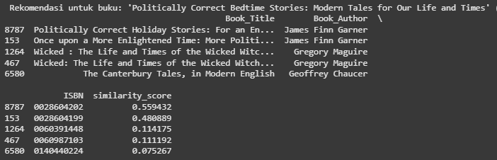


#### 1.4. Hasil Top-N Rekomendasi Content-Based
Sistem mengambil satu judul buku sebagai input, mencari skor kemiripannya terhadap semua buku lain menggunakan `similarity_matrix`, mengurutkan skor tersebut, dan menampilkan N buku teratas yang paling mirip (tidak termasuk buku input itu sendiri).

* **Contoh Rekomendasi Content-Based-Filtering**:

```
Rank          Book_Title        Book_Author             Publisher      Similarity Score
1       Manhunting (Mira)   Jennifer Crusie                 Mira            0.437
2       What The Lady Wants Jennifer Crusie                 Mira            0.402
3       Strange Bedpersons  Jennifer Crusie                 Mira            0.398
4       Faking It Jennifer  Crusie St. Martin's             Press           0.250
5       Crazy for You       Jennifer Crusie St. Martin's    Press           0.249 
```
* **Penjelasan**: Rekomendasi yang dihasilkan berdasarkan kemiripan konten cocok untuk pengguna baru yang belum banyak memberikan rating (mengatasi *cold-start problem* untuk pengguna). Sistem ini juga bisa membantu pengguna menemukan buku dengan tema, penulis, atau penerbit yang serupa dengan yang pernah mereka nikmati.

#### 1.5. Kelebihan dan Kekurangan Content-Based Filtering
* **Kelebihan**:
    * **Tidak Membutuhkan Data Pengguna Lain**: Rekomendasi untuk satu pengguna tidak dipengaruhi oleh data pengguna lain.
    * ***No Cold Start* untuk Item (Buku Baru)**: Dapat merekomendasikan buku baru selama metadata kontennya tersedia.
    * **Transparan dan Dapat Dijelaskan**: Rekomendasi dapat dijelaskan berdasarkan kesamaan fitur buku (misalnya, "Direkomendasikan karena memiliki penulis atau tema yang sama").
    * **Personalisasi Sesuai Selera Spesifik**: Dapat menangkap minat spesifik pengguna pada atribut buku tertentu jika pengguna memberikan *feedback* pada item tersebut.

* **Kekurangan**:
    * **Ketergantungan pada Kualitas Metadata**: Efektivitas sangat bergantung pada kelengkapan dan kualitas fitur konten yang diekstrak. Deskripsi yang buruk atau fitur yang tidak representatif akan menghasilkan rekomendasi yang buruk.
    * ***Limited Discovery* (Filter Bubble)**: Cenderung merekomendasikan buku yang sangat mirip dengan apa yang sudah disukai pengguna, kurang mampu mengeksplorasi genre atau penulis yang benar-benar baru bagi pengguna (serendipity rendah).
    * ***Cold Start* untuk Pengguna Baru**: Meskipun dapat merekomendasikan buku *berdasarkan buku lain*, sistem ini masih kesulitan memberikan rekomendasi yang dipersonalisasi untuk pengguna baru yang belum memiliki riwayat interaksi (suka/rating) dengan buku manapun untuk membangun profil preferensinya.
    * ***Over-specialization***: Jika pengguna hanya menyukai satu jenis buku atau fitur tertentu, sistem akan terus merekomendasikan jenis buku itu saja.

### 2. Collaborative Filtering (SVD dengan Surprise)

Pendekatan Collaborative Filtering (CF) merekomendasikan item berdasarkan kesamaan preferensi antar pengguna. Jika pengguna A dan B memiliki pola rating yang mirip di masa lalu, maka buku yang disukai B tetapi belum dibaca A kemungkinan akan direkomendasikan ke A.

#### 2.1. Pelatihan Model SVD
* **Algoritma dan Parameter**:
    * Algoritma Singular Value Decomposition (SVD) dari library `scikit-surprise` digunakan. SVD adalah teknik faktorisasi matriks yang efektif untuk menemukan pola laten dalam data interaksi pengguna-item.
    * Parameter yang digunakan dalam pelatihan model: `n_factors=50` (jumlah faktor laten), `n_epochs=30` (jumlah iterasi pelatihan), `biased=True` (menggunakan baseline estimate), `lr_all=0.005` (learning rate), dan `reg_all=0.01` (faktor regularisasi).
    ```python
    algo_svd = SVD(n_factors=50, n_epochs=30, biased=True, lr_all=0.005, reg_all=0.01)
    print("Training SVD model...")
    algo_svd.fit(trainset)
    ```
    * **Penjelasan**: SVD memfaktorisasi matriks interaksi pengguna-item (dalam hal ini, rating buku) menjadi dua matriks berdimensi lebih rendah yang merepresentasikan faktor laten pengguna dan item. Parameter yang dipilih dapat dioptimasi lebih lanjut (menggunakan Grid Search) untuk performa yang lebih baik, namun parameter yang ada sudah cukup baik untuk menunjukkan kapabilitas model. SVD efektif untuk mengatasi masalah *sparsity* (banyaknya rating yang hilang) dalam dataset.

#### 2.2. Pembuatan Prediksi pada Test Set
* Setelah model dilatih pada `trainset`, model tersebut digunakan untuk membuat prediksi rating pada `testset` (data yang tidak terlihat selama pelatihan).
    ```python
    print("Making predictions on test set...")
    predictions = algo_svd.test(testset)
    
    print("--- Collaborative Filtering Modeling Complete ---")    
    ```
* **Penjelasan**: Hasil `predictions` ini akan digunakan pada tahap evaluasi untuk menghitung metrik seperti RMSE dan MAE, yang mengukur seberapa akurat prediksi rating model dibandingkan dengan rating aktual.

#### 2.3. Hasil Top-N Rekomendasi Collaborative Filtering

**Rekomendasi Collaborative Filtering**

Untuk User 80954:
|Rank	|ISBN	|Predicted Rating	|Book Title|
|------|--------|-------|--------------------|
|1	|015668568X	|7.807	|Old Possum's Book of Practical Cats, IllustratedEdition|
|2	|0446679593	|7.658	|Suzanne's Diary for Nicholas|
|3	|0684853515	|7.533	|Hearts In Atlantis : New Fiction|

Untuk User 15497:
|Rank	|ISBN	|Predicted Rating	|Book Title|
|------|----------|------------------|-------|
|1	|0385335881	|8.252	|Shopaholic Takes Manhattan (Summer Display Opportunity)|
|2	|0679783571	|8.054	|The Broke Diaries: The Completely True and Hilarious   |  Misadventures of a Good Girl Gone Broke|
|3	|0440222842	|7.629	|Five Days in Paris|


Untuk User 151370:
| Rank | ISBN | Predicted Rating | Book Title |
|------|----------|------------------|-------|
| 1 | 0553375407 | 7.852 |  Ishmael: An Adventure of the Mind and Spirit |
| 2 | 155874262X | 7.180 | Chicken Soup for the Soul (Chicken Soup for the Soul) |

* **Penjelasan**: Rekomendasi ini sangat dipersonalisasi karena didasarkan pada pola rating pengguna dan kemiripannya dengan pengguna lain, bukan hanya konten buku. Ini memungkinkan penemuan buku yang mungkin tidak terduga namun relevan (*serendipity*).

#### 2.4. Kelebihan dan Kekurangan Collaborative Filtering
* **Kelebihan**:
    * **Tidak Membutuhkan Metadata Item**: Tidak bergantung pada fitur konten buku; dapat bekerja bahkan jika deskripsi buku minim atau tidak tersedia.
    * ***Serendipitous Recommendations***: Mampu menemukan item baru yang menarik bagi pengguna yang mungkin tidak akan mereka temukan sendiri jika hanya mengandalkan kesamaan konten. Dapat merekomendasikan item yang secara konten berbeda namun disukai oleh pengguna dengan selera serupa.
    * **Menangkap Pola Kompleks**: Dapat mempelajari nuansa preferensi pengguna yang sulit dideskripsikan oleh fitur konten.

* **Kekurangan**:
    * ***Cold Start Problem***:
        * **Pengguna Baru**: Sulit memberikan rekomendasi yang akurat untuk pengguna baru yang belum memiliki riwayat rating yang cukup untuk dibandingkan dengan pengguna lain.
        * **Item Baru**: Buku baru yang belum mendapatkan rating dari pengguna manapun tidak dapat direkomendasikan melalui CF murni.
    * ***Data Sparsity***: Kinerja dapat menurun jika matriks interaksi pengguna-item sangat jarang (artinya, sebagian besar pengguna belum memberi rating pada sebagian besar item). Dataset Book-Crossing bisa cukup sparse.
    * ***Popularity Bias***: Cenderung merekomendasikan item populer yang sudah banyak di-rating oleh banyak pengguna, sehingga item yang kurang populer (niche) mungkin kurang terwakili.
    * **Kurang Dapat Dijelaskan (*Black Box*)**: Meskipun efektif, seringkali sulit untuk menjelaskan secara intuitif mengapa suatu item direkomendasikan kepada pengguna, selain karena "pengguna lain yang mirip dengan Anda juga menyukainya."

---
## Evaluation

Tahap evaluasi bertujuan untuk mengukur kinerja dari kedua model sistem rekomendasi yang telah dibangun: Collaborative Filtering dan Content-Based Filtering. Metrik evaluasi yang digunakan disesuaikan dengan sifat masing-masing model dan tujuan yang ingin dicapai.

### 1. Evaluasi Collaborative Filtering (SVD)

Model Collaborative Filtering dengan algoritma SVD dievaluasi berdasarkan kemampuannya dalam memprediksi rating yang akan diberikan pengguna terhadap buku.

#### Metrik yang Digunakan
Metrik utama yang digunakan adalah:
1.  **RMSE (Root Mean Squared Error)**:
    * **Formula**: $RMSE = \sqrt{\frac{1}{N}\sum_{i=1}^{N}(y_i - \hat{y}_i)^2}$
        Dimana $y_i$ adalah rating aktual, $\hat{y}_i$ adalah rating prediksi oleh model, dan $N$ adalah jumlah total prediksi dalam dataset uji.
    * **Cara Kerja**: RMSE mengukur akar dari rata-rata kuadrat selisih antara nilai rating aktual dan nilai rating yang diprediksi. Metrik ini memberikan bobot yang lebih besar pada kesalahan prediksi yang besar karena adanya proses pengkuadratan. Semakin kecil nilai RMSE, semakin baik kinerja model dalam memprediksi rating secara akurat.
2.  **MAE (Mean Absolute Error)**:
    * **Formula**: $MAE = \frac{1}{N}\sum_{i=1}^{N}|y_i - \hat{y}_i|$
        Dimana $y_i$ adalah rating aktual, $\hat{y}_i$ adalah rating prediksi, dan $N$ adalah jumlah total prediksi.
    * **Cara Kerja**: MAE mengukur rata-rata dari nilai absolut selisih antara rating aktual dan rating prediksi. Metrik ini memberikan gambaran langsung mengenai seberapa besar rata-rata kesalahan prediksi model, tanpa memberikan bobot lebih pada kesalahan besar seperti RMSE. Semakin kecil nilai MAE, semakin baik kinerja model.

#### Implementasi Evaluasi
Nilai RMSE dan MAE dihitung menggunakan fungsi dari library `scikit-surprise` pada `predictions` yang dihasilkan dari `testset`.
```python
rmse = accuracy.rmse(predictions, verbose=True) # verbose=True akan langsung mencetak hasilnya
mae = accuracy.mae(predictions, verbose=True)  # verbose=True akan langsung mencetak hasilnya

print(f"Root Mean Squared Error (RMSE): {rmse:.4f}")
print(f"Mean Absolute Error (MAE): {mae:.4f}")
```

#### Hasil Evaluasi Collaborative Filtering
* **RMSE**: 1.5850
* **MAE**: 1.2119

Nilai RMSE sebesar 1.5850 menunjukkan bahwa, secara rata-rata, prediksi rating oleh model SVD memiliki simpangan sekitar 1.59 poin dari rating aktual pada skala rating 1-10 yang digunakan (setelah filtering rating 0). Demikian pula, nilai MAE sebesar 1.2119 berarti rata-rata kesalahan absolut prediksi model adalah sekitar 1.21 poin.

Mengingat skala rating adalah 1-10, nilai error ini cukup baik dan mengindikasikan bahwa model SVD memiliki kemampuan yang cukup baik dalam memprediksi preferensi pengguna. Meskipun selalu ada ruang untuk perbaikan, selisih rata-rata 1.2 hingga 1.6 poin pada skala 10 poin menunjukkan bahwa prediksi model tidak terlalu jauh dari rating sebenarnya.

Sebuah visualisasi bar chart juga dibuat untuk membandingkan nilai RMSE dan MAE secara visual, memberikan representasi yang jelas mengenai tingkat error model.
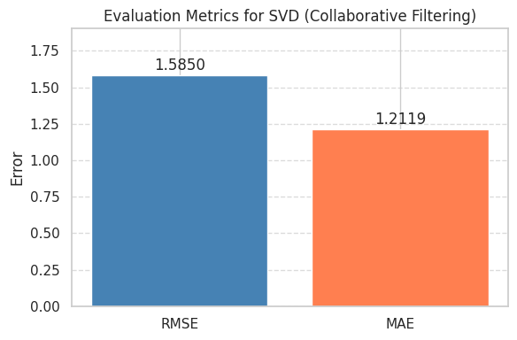

### 2. Evaluasi Content-Based Filtering

Model Content-Based Filtering dievaluasi berdasarkan kemampuannya merekomendasikan item yang relevan dari daftar Top-N. Evaluasi dilakukan menggunakan fungsi `evaluate_content_based` yang menghitung rata-rata Precision@K dan Recall@K.

#### Metrik yang Digunakan
1.  **Average Precision@K**:
    * **Formula Umum**: $Precision@K = \frac{\text{Jumlah item relevan dalam Top-K rekomendasi}}{\text{K}}$
    * **Cara Kerja dalam Konteks Ini**: Untuk setiap pengguna, sistem mengidentifikasi buku "relevan" (rating $\ge$ `relevance_threshold`). Kemudian, untuk setiap buku relevan tersebut, `top_n` rekomendasi content-based dihasilkan. Precision dihitung sebagai rasio `hits` (rekomendasi yang juga ada di daftar buku relevan pengguna) terhadap total slot rekomendasi yang dihasilkan (`top_n` * jumlah buku relevan sebagai seed). Hasilnya dirata-ratakan untuk semua pengguna.
2.  **Average Recall@K**:
    * **Formula Umum**: $Recall@K = \frac{\text{Jumlah item relevan dalam Top-K rekomendasi}}{\text{Total jumlah item relevan untuk pengguna}}$
    * **Cara Kerja dalam Konteks Ini**: Menggunakan `hits` yang sama, recall dihitung sebagai rasio `hits` terhadap total buku relevan milik pengguna. Hasilnya dirata-ratakan.

#### Hasil Evaluasi Content-Based Filtering
Berdasarkan pemanggilan fungsi `evaluate_content_based` dengan `final_ratings` sebagai data uji, `top_n=5`, dan `relevance_threshold=5.0`:
* **Jumlah User Dievaluasi**: 10.100
* **Average Precision@5**: 0.0067 (0.67%)
* **Average Recall@5**: 0.0335 (3.35%)

**Analisis Average Precision@5 dan Average Recall@5:**
* **Average Precision@5 = 0.67%**: Nilai ini menunjukkan bahwa dari total slot rekomendasi yang dihasilkan untuk seorang pengguna (berdasarkan 5 rekomendasi untuk setiap buku yang diratingnya tinggi sebagai *seed item*), rata-rata hanya 0.67% dari slot tersebut yang diisi oleh buku yang juga dianggap relevan oleh pengguna. Ini berarti, secara kasar, untuk setiap 150 slot rekomendasi yang dihasilkan dengan strategi ini, hanya sekitar 1 yang "tepat sasaran".
* **Average Recall@5 = 3.35%**: Nilai ini mengindikasikan bahwa dari semua buku yang memang dianggap relevan (disukai) oleh seorang pengguna, sistem berhasil menemukan kembali dan merekomendasikan (melalui gabungan rekomendasi dari semua *seed item*-nya) sekitar 3.35% di antaranya.
* **Interpretasi Nilai Rendah**:
    * **Karakteristik Dataset Book-Crossing dan Fitur Konten**: Dataset ini dikenal memiliki *sparsity* yang tinggi, dan preferensi pengguna bisa sangat beragam. Fitur konten yang digunakan (`Book_Title`, `Book_Author`, `Publisher`) mungkin terlalu sederhana untuk menangkap nuansa kompleks yang membuat seseorang menyukai sebuah buku.
    * **Sifat Konservatif Content-Based Filtering**: Sistem cenderung merekomendasikan item yang sangat mirip secara tekstual. Jika kemiripan tekstual tidak selalu berkorelasi kuat dengan preferensi rating pengguna, presisi akan rendah.
    * **Strategi Evaluasi**: `relevance_threshold=5.0` pada skala 1-10 adalah standar yang cukup moderat. Namun, cara agregasi rekomendasi (mengumpulkan dari banyak *seed item*) dapat menghasilkan set rekomendasi yang besar, sehingga `hits` mungkin kecil relatif terhadap total.

**Analisis Kualitatif Content-Based:**
* **Kesamaan Fitur yang Tinggi**: Dapat diasumsikan bahwa rekomendasi yang dihasilkan akan menunjukkan kesamaan yang tinggi pada penulis, penerbit, atau kata kunci dalam judul. Misalnya, buku dari seri yang sama atau penulis yang sama akan sering muncul.
* **Akurasi Deteksi Kesamaan Konten**: Algoritma TF-IDF dan Cosine Similarity umumnya akurat dalam mendeteksi kesamaan tekstual berdasarkan fitur yang diberikan.
* **Diversitas Rekomendasi**: Diversitas kemungkinan akan rendah, terutama jika pengguna memiliki preferensi kuat pada penulis atau seri tertentu. Sistem akan cenderung menguatkan preferensi tersebut.

### 3. Perbandingan Metrik Evaluasi

| Metrik                | Collaborative Filtering (SVD) | Content-Based Filtering      |
| :-------------------- | :---------------------------- | :--------------------------- |
| **RMSE** | 1.585                        | -                            |
| **MAE** | 1.2119                        | -                            |
| **Average Precision@5** | -                             | 0.0067 (0.67%)               |
| **Average Recall@5** | -                             | 0.0335 (3.35%)               |

**Mengapa Metrik Berbeda:**
* **Collaborative Filtering (SVD)** bertujuan utama untuk memprediksi nilai rating yang akan diberikan pengguna pada suatu item. Oleh karena itu, RMSE dan MAE adalah metrik yang tepat karena mengukur error antara rating prediksi dan rating aktual.
* **Content-Based Filtering** dalam implementasi ini menghasilkan skor kesamaan antar item, yang kemudian digunakan untuk membuat daftar rekomendasi Top-N. Model ini tidak secara langsung memprediksi rating. Oleh karena itu, Precision@K dan Recall@K digunakan untuk mengevaluasi seberapa relevan item-item dalam daftar rekomendasi tersebut.

### 4. Kontekstualisasi dengan Problem Statement

#### Sesuai dengan Konteks Data (Book-Crossing)
* **Dataset Book-Crossing**: Dataset ini cukup besar (lebih dari 1 juta rating, ratusan ribu buku dan pengguna sebelum filtering). Skala rating 0-10 (0 untuk implisit, 1-10 untuk eksplisit).
* **Sparsity Challenge**: Seperti kebanyakan dataset rekomendasi, Book-Crossing memiliki *sparsity* yang signifikan, yang menjadi tantangan terutama untuk Collaborative Filtering. Proses filtering pada tahap persiapan data (pengguna aktif, buku populer) bertujuan mengurangi dampak ini.
* **Metadata Konten**: Informasi yang digunakan untuk Content-Based (`Book_Title`, `Book_Author`, `Publisher`) memberikan dasar untuk pendekatan berbasis konten, meskipun mungkin tidak selengkap dataset lain yang memiliki deskripsi atau genre yang lebih detail.

#### Sesuai dengan Problem Statement
1.  **Kesulitan Menemukan Buku yang Sesuai (Information Overload)**:
    * CF (RMSE/MAE): Dengan memprediksi rating, sistem dapat membantu menyaring dan me-*ranking* buku, mengurangi jumlah pilihan yang harus dipertimbangkan pengguna.
    * CBF (Precision/Recall): Dengan menyajikan daftar Top-N item serupa, sistem membantu pengguna menemukan buku yang relevan dengan minat mereka berdasarkan konten.
2.  **Penemuan Konten Buku Baru dan Beragam**:
    * CF: Dapat membantu menemukan buku yang mungkin tidak terduga (*serendipitous*) berdasarkan selera pengguna lain, meskipun ada potensi *popularity bias*.
    * CBF (Precision/Recall): Mengukur seberapa baik sistem menemukan buku relevan berdasarkan kemiripan konten. Potensi penemuan beragam terbatas oleh fitur konten.
3.  **Personalisasi**:
    * CF (RMSE/MAE): Secara inheren bersifat personal karena didasarkan pada riwayat rating unik pengguna dan perbandingannya dengan pengguna lain.
    * CBF: Personalisasi terjadi ketika sistem merekomendasikan item serupa dengan yang telah disukai pengguna.

#### Sesuai dengan Solusi yang Diinginkan
* **Top-N Recommendation**: Precision@K dan Recall@K (untuk CBF) secara langsung mengukur kualitas dari daftar Top-N rekomendasi. Untuk CF, prediksi rating yang akurat (RMSE/MAE rendah) menjadi dasar untuk menghasilkan Top-N rekomendasi yang baik.
* **Prediksi Rating Akurat**: RMSE dan MAE (untuk CF) secara eksplisit mengukur akurasi prediksi rating.
* **Mengatasi Cold Start**: CBF lebih unggul dalam mengatasi *cold start* untuk buku baru (selama ada metadata). Untuk pengguna baru, kedua pendekatan masih memiliki tantangan, namun CBF dapat memberikan rekomendasi jika pengguna memilih satu buku awal.

### 5. Kesimpulan Evaluasi

**Collaborative Filtering (SVD)**:
* Menunjukkan performa yang **cukup baik** dengan RMSE 1.5850 dan MAE 1.2119 pada skala rating 1-10. Ini mengindikasikan kemampuan model untuk memprediksi preferensi pengguna dengan tingkat kesalahan yang dapat diterima.
* Cocok untuk memberikan rekomendasi yang dipersonalisasi secara akurat kepada pengguna dengan riwayat rating yang memadai.
* Efektif dalam menangani tugas personalisasi dan prediksi rating.

**Content-Based Filtering**:
* Average Precision@5 sebesar 0.67% dan Average Recall@5 sebesar 3.35% menunjukkan bahwa pendekatan ini, dengan fitur konten yang digunakan (`Book_Title`, `Book_Author`, `Publisher`), memiliki **ruang signifikan untuk perbaikan** dalam menemukan buku yang sangat relevan bagi sebagian besar pengguna.
* Secara kualitatif, model ini diharapkan dapat menemukan item dengan kesamaan tekstual yang tinggi pada fitur yang digunakan (misalnya, buku dari penulis atau seri yang sama).
* Efektif sebagai solusi dasar untuk mengatasi *cold start problem* untuk buku baru yang memiliki metadata.

**Rekomendasi untuk Implementasi**:
* Gunakan **Collaborative Filtering (SVD)** sebagai metode utama untuk pengguna yang memiliki riwayat interaksi (rating) yang cukup, karena kemampuannya dalam personalisasi yang lebih mendalam.
* Gunakan **Content-Based Filtering** untuk situasi berikut:
    * Ketika buku baru ditambahkan ke sistem (mengatasi *cold start* item).
    * Untuk pengguna baru yang dapat memilih beberapa buku atau penulis yang mereka sukai sebagai titik awal.
    * Sebagai pelengkap untuk CF, misalnya untuk menjelaskan mengapa suatu item direkomendasikan ("karena Anda menyukai buku lain dari penulis ini").
* Pertimbangkan pengembangan **Pendekatan Hybrid** di masa depan, yang mengombinasikan kekuatan Collaborative Filtering (akurasi personalisasi) dengan Content-Based Filtering (kemampuan mengatasi *cold start* dan memberikan penjelasan). Peningkatan fitur konten untuk CBF (misalnya, menggunakan deskripsi buku atau genre jika tersedia) juga dapat meningkatkan kinerjanya.

